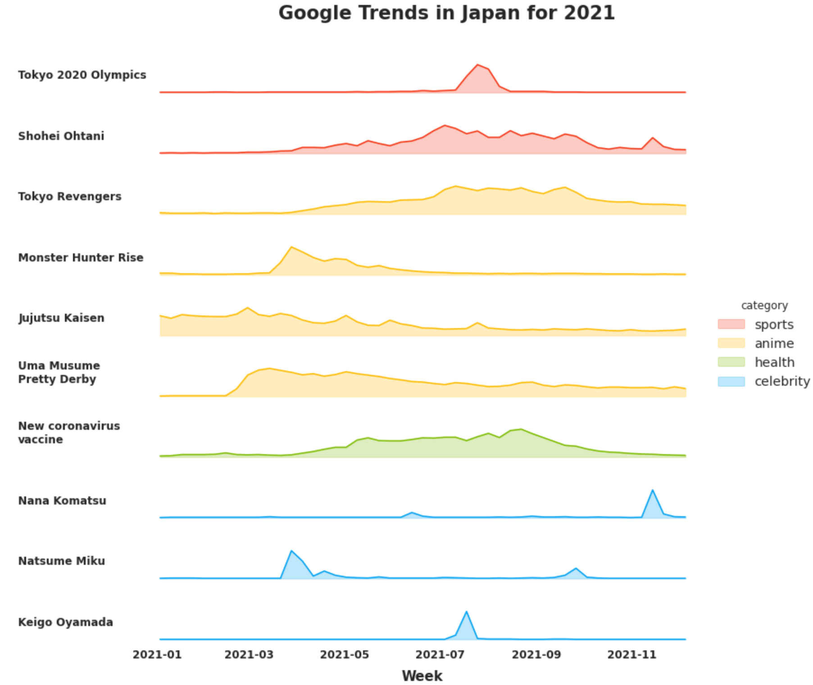

# Google Trends 2021
Visualizing Google search trends in Japan in 2021

## Data sources
Data for the top 10 most searched terms in Japan in 2021 were downloaded from Google's Year in Search found here: https://trends.google.com/trends/yis/2021/JP/.

## To do
- Add Japanese labels
- Add sensible hues (e.g. by category)
- Improve overall readability (e.g. increase font size)

## Visualizing the search trends
Below is a *very* early attempt

