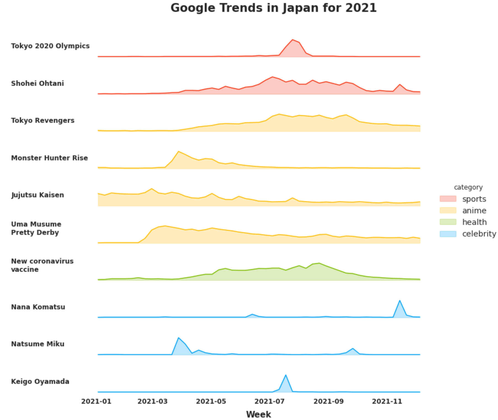

# Google Trends 2021
Visualizing Google search trends in Japan in 2021

## Data source
Data for the top 10 most searched terms in Japan in 2021 were downloaded from Google's Year in Search found here: https://trends.google.com/trends/yis/2021/JP/.
It is important to note that the data presented show max and min relative to their own search volume. From Google: "Each data point is divided by the total searches of the geography and time range it represents to compare relative popularity...The resulting numbers are then scaled on a range of 0 to 100 based on a topic’s proportion to all searches on all topics."

## Data visualization
While the output is ridge plot-like, the normal approaches for generating a ridge plot using KDE were not applicable to this data. As such, a simple line plot of time vs. popularity was used.

Challenges I faced while manipulating the Seaborn plot:
- Filling the space between the line and the x-axis
- Setting custom colors for each category to match Google's color palette
- Placing each subplot's title to the left-center of each plot (it must be done manually)

## Google Trends in Japan for 2021
Trends are shown in descending order (from most popular)

